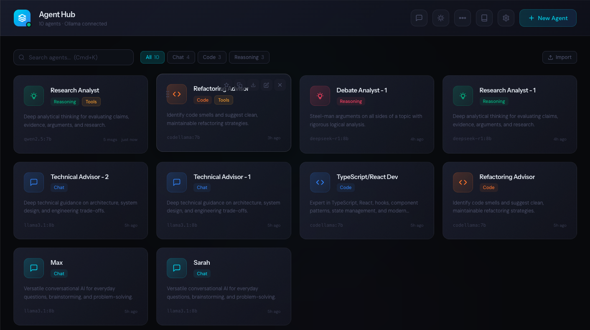

# AI Agent Hub

A desktop-style AI agent management application. Create, configure, and interact with multiple AI agents powered by local Ollama models. Each agent appears as a card on a grid and can be clicked to open a chat panel.


## Features

**Agent Management**
- Create agents from 30+ presets (code reviewers, debuggers, writers, reasoning, etc.) or build custom ones
- Drag-and-drop reorder, pin favorites, clone, export/import as JSON
- Search and filter by type, name, or model
- Per-agent system prompts, model selection, and tool configuration

**Chat**
- Streaming responses with markdown rendering (syntax highlighting, GFM tables, code copy)
- Image/file attachments with drag-and-drop and paste support
- Conversation memory with automatic windowing and summary injection
- Message actions: copy, retry, delete
- Agent-to-agent conversations with configurable turns and free talk mode

**Tools & Integrations**
- Filesystem tools: read, write, search, list, execute commands (with path sandboxing)
- MCP (Model Context Protocol) server support via stdio transport
- Per-agent tool permissions and confirmation modes (auto/confirm)
- Knowledge bases via ChromaDB: ingest files/directories, RAG-augmented chat

**Workflows**
- Multi-step pipelines chaining agents sequentially
- Scheduled execution via cron expressions
- Real-time execution monitoring with SSE streaming
- Cancellation support

**Reliability**
- Rate limiting (per-IP sliding window, per-route tiers)
- MCP server health monitoring with auto-restart
- Structured logging (JSON/text, rotation, per-request timing)
- Deep health checks (DB, Ollama, ChromaDB, MCP)

**Security**
- MCP environment variable encryption at rest (Fernet)
- Content Security Policy and security headers
- XSS prevention (rehype-sanitize)
- Configurable CORS origins

## Tech Stack

| Layer | Stack |
|-------|-------|
| Frontend | React 19, TypeScript, Vite, Tailwind CSS v4, Zustand |
| Backend | Python, FastAPI, SQLAlchemy (async), LangChain |
| LLM | Ollama (local models) |
| Vector DB | ChromaDB |
| Database | SQLite (aiosqlite) |
| Tools | MCP servers (stdio), built-in filesystem tools |

## Prerequisites

- [Ollama](https://ollama.ai) installed and running
- Python 3.11+
- Node.js 18+

## Setup

### Backend

```bash
cd backend
python -m venv venv
source venv/bin/activate
pip install -r requirements.txt
```

### Frontend

```bash
cd frontend
npm install
```

### Pull a model

```bash
ollama pull llama3.2
```

## Running

**Quick start (both services):**

```bash
./start.sh
```

**Or start separately:**

```bash
# Terminal 1 - Backend
cd backend
source venv/bin/activate
uvicorn app.main:app --host 0.0.0.0 --port 8000 --reload

# Terminal 2 - Frontend
cd frontend
npm run dev
```

- Frontend: http://localhost:5173
- Backend API: http://localhost:8000
- API Docs: http://localhost:8000/docs

## Project Structure

```
backend/
  app/
    agents/          # LLM engine, tools, MCP bridge
    middleware/       # Rate limiting, security headers
    models/           # SQLAlchemy models + Pydantic schemas
    rag/              # ChromaDB retrieval
    routes/           # FastAPI endpoints
    services/         # Business logic
    utils/            # Encryption utilities
  requirements.txt
frontend/
  src/
    api/              # API client
    components/       # React components
    data/             # Agent presets
    store/            # Zustand state management
    types/            # TypeScript interfaces
    utils/            # Helpers
start.sh              # Launch both services
```

## Environment Variables

| Variable | Default | Description |
|----------|---------|-------------|
| `OLLAMA_BASE_URL` | `http://localhost:11434` | Ollama API endpoint |
| `DATABASE_URL` | `sqlite+aiosqlite:///./agents.db` | Database connection string |
| `CORS_ORIGINS` | `http://localhost:5173,http://localhost:3000` | Allowed CORS origins |
| `MCP_ENCRYPTION_KEY` | Auto-generated | Fernet key for MCP env var encryption |
| `LOG_LEVEL` | `INFO` | Logging level |
| `LOG_FILE` | `logs/agent-hub.log` | Log file path |
| `LOG_FORMAT` | `text` | Log format (`text` or `json`) |

## API Overview

| Endpoint Group | Description |
|---------------|-------------|
| `GET/POST/PATCH/DELETE /api/agents` | Agent CRUD |
| `PUT /api/agents/reorder` | Drag-and-drop ordering |
| `POST /api/chat/message` | Streaming chat (SSE) |
| `POST /api/chat/agent-to-agent` | Agent-to-agent conversation |
| `GET/POST /api/workflows` | Workflow management |
| `POST /api/workflows/{id}/execute` | Workflow execution (SSE) |
| `GET/POST /api/knowledge` | Knowledge base management |
| `POST /api/knowledge/{id}/ingest/*` | Document ingestion |
| `GET/POST /api/mcp/servers` | MCP server management |
| `GET /api/mcp/health` | MCP connection health |
| `GET /api/ollama/models` | Available models |
| `GET /api/health` | Health check |
| `GET /api/health/deep` | Deep health check (all dependencies) |

Full interactive docs at `/docs` when the backend is running.

## License

Apache 2.0
